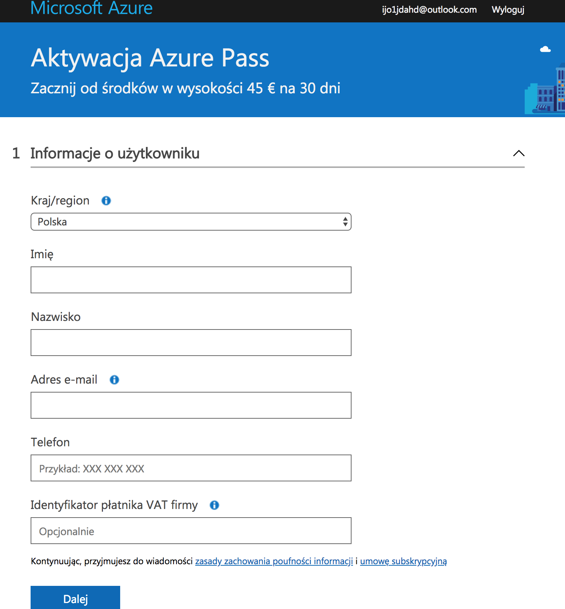

# Activating Azure for Students

## Account verification

Proceed to the [http://portal.azure.com](http://portal.azure.com) website:

Create a **new account** using your **name.surname@student.put.poznan.pl** account.

Keep yourself logged in.

## Activating Azure for Students

To activate Azure for Students proceed to the website [https://azure.microsoft.com/pl-pl/free/students/](https://azure.microsoft.com/pl-pl/free/students/) and choose "**activate**". You will receive **$100** and additional free services.

Verify your student status with a **School email address** and type:  **name.surname@student.put.poznan.pl**


You can create another accounts using aliases: **name.surname@student.put.edu.pl, inf122444@student.put.poznan.pl** and **inf122444@student.put.edu.pl**


A valid telephone number is required for a successful verification. You will receive an SMS with a confirmation code.


You can use a single phone number for a **multiple** accounts.


Creating a new account should take no longer than 5 minutes.

