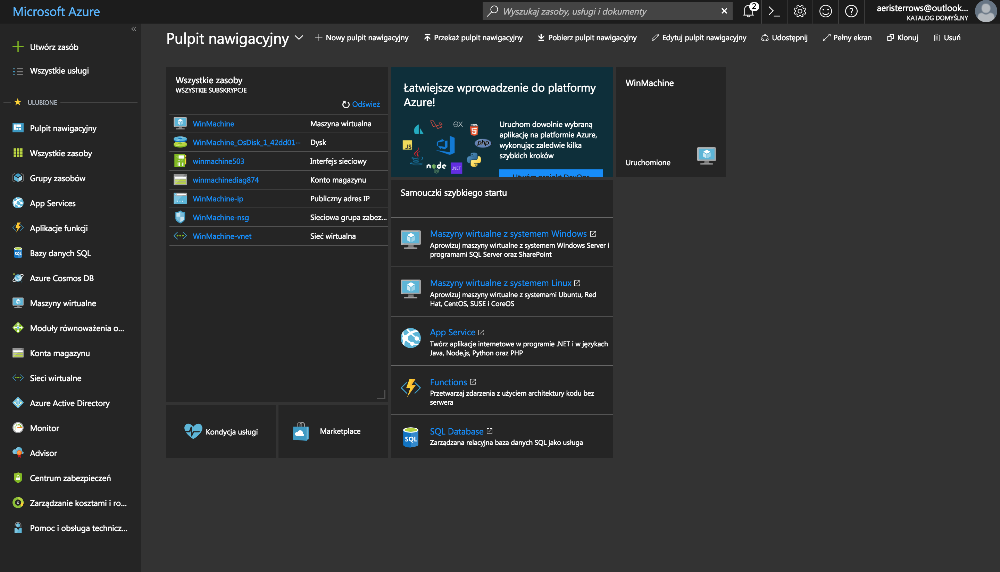
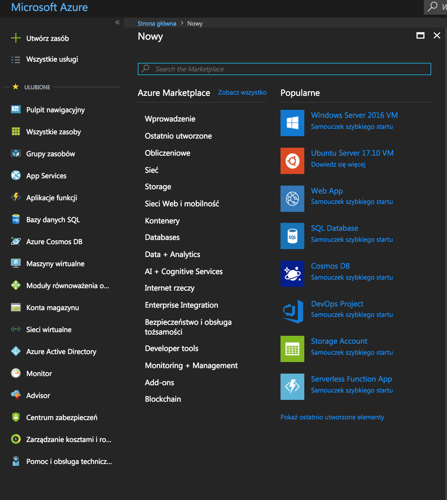
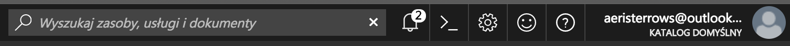

# Hello Azure Portal

You can reach the portal using this link : [https://portal.azure.com/](https://portal.azure.com/)

## Portal overview



**Here everything begins!**

On the **left** part of the portal you can find a list of resource categories, monitoring tools, analysis and management of your subscription.


To remove resource groups use an external helper tool: [https://resources.azure.com/](https://resources.azure.com/)


On the **top bar** you can find a search input, notification center and Azure Cloud Shell button.

To easily find your resources you can use dashboards \(yes, you can have more than one!\). Using a tile system known from a Windows you can easily manage your resources and widgets. Remember that not every resource appears on the dashboard - only pinned ones.


You can add more users to your subscriptions - developers or sysadmins.


## Azure Marketplace

After clicking a "New Resource" button on the left you can find the "Azure Marketplace" - a set of ready-to-use templates, which are helping to deploy complicated systems with one click. You can find Wordpress CRM, configured machine clusters for data processing or virtual machine with a Windows 10 with pre-installed Visual Studio.



## Azure Cloud Shell

If terminal is your home, you will gladly welcome **Microsoft Azure SDK** \(available for Windows, OSX and Linux\) which rests your mouse and helps you to make automatic scripts, which would require a 50+ mouse clicks in portal.

{% embed data="{\"url\":\"https://azure.microsoft.com/en-us/blog/using-windows-azure-with-the-command-line-tools-for-mac-and-linux/\",\"type\":\"link\",\"title\":\"Using Windows Azure With the Command Line Tools for Mac and Linux\",\"description\":\"Alongside the introduction of Windows Azure Web Sites and exciting new Virtual Machine capabilities, we recently released a set of open source command line tools that allow you to manage and deploy…\",\"icon\":{\"type\":\"icon\",\"url\":\"https://azurecomcdn.azureedge.net/cvt-a845dff1bcbf674c04a243c4798ba0e4eb81d06669d01df49ba5367ed02881d5/images/icon/apple-touch/180x180.png\",\"width\":180,\"height\":180,\"aspectRatio\":1},\"thumbnail\":{\"type\":\"thumbnail\",\"url\":\"https://acom.azurecomcdn.net/80C57D/blogmedia/migratedblogimages/1033.Cmd1.png\",\"width\":550,\"height\":390,\"aspectRatio\":0.7090909090909091},\"caption\":\"\"}" %}

You can also use your Bash knowledge \(or PowerShell\) without leaving your portal.

{% embed data="{\"url\":\"https://azure.microsoft.com/pl-pl/features/cloud-shell/\",\"type\":\"link\",\"title\":\"Azure Cloud Shell — wiersz polecenia w przeglądarce \| Microsoft Azure\",\"description\":\"Oparte na przeglądarce środowisko powłoki w chmurze, które jest konserwowane przez firmę Microsoft i służy do zarządzania zasobami platformy Azure przy użyciu popularnych narzędzi wiersza polecenia i języków programowania\",\"icon\":{\"type\":\"icon\",\"url\":\"https://azurecomcdn.azureedge.net/cvt-a845dff1bcbf674c04a243c4798ba0e4eb81d06669d01df49ba5367ed02881d5/images/icon/apple-touch/180x180.png\",\"width\":180,\"height\":180,\"aspectRatio\":1},\"thumbnail\":{\"type\":\"thumbnail\",\"url\":\"https://azurecomcdn.azureedge.net/cvt-4ba1ac63410bb2bbe9f1c2a7bedc57894bbe9754309d9d380deedcdf7850047e/images/shared/social/azure-icon-250x250.png\",\"width\":250,\"height\":250,\"aspectRatio\":1}}" %}

Click on the **&gt;\_**  icon and on the bottom part of the portal you shall see a Azure Cloud Shell terminal:




**Azure Cloud Shell requires Azure Storage for permanent storage.** It will create a new resource.


Try to reach available subscriptions with command:

```bash
az account list
```

We are ready to create our first resource - our virtual workspace.

