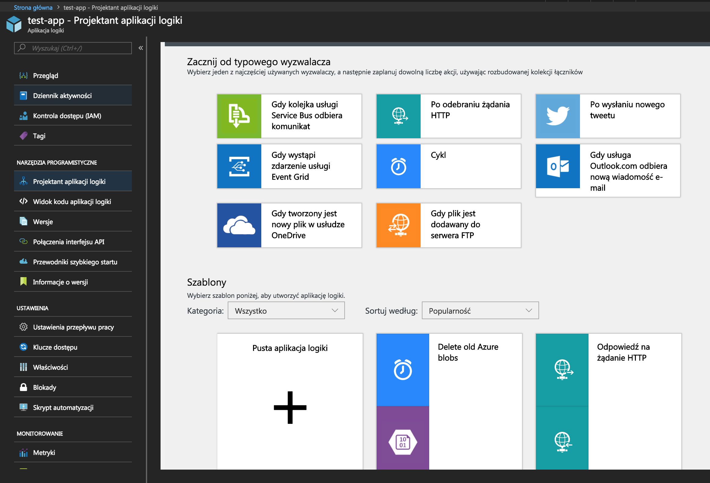
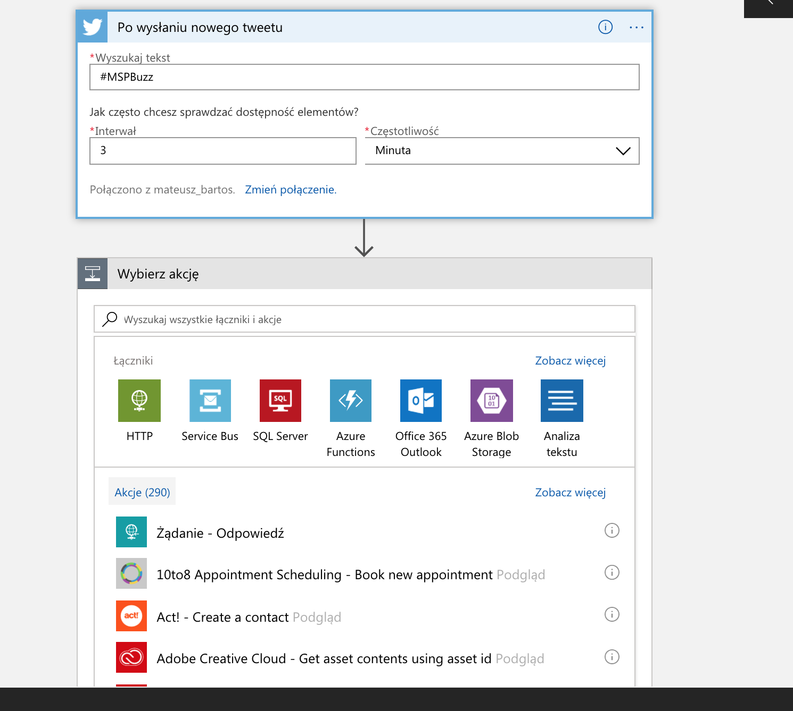
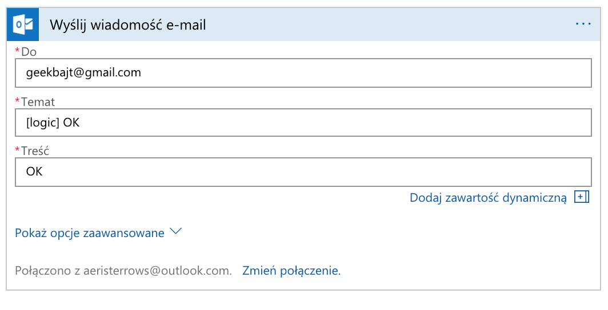
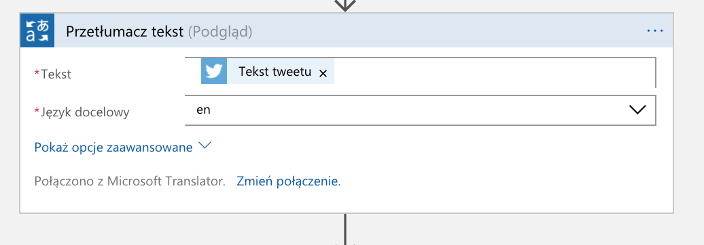
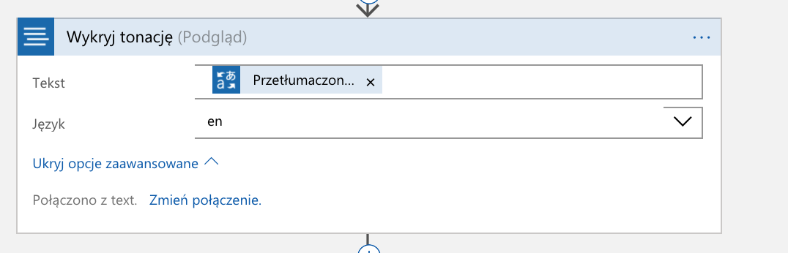
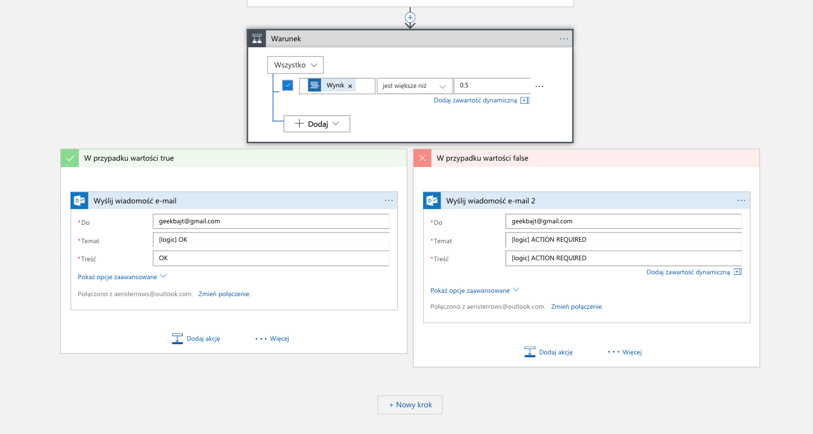

# Logic App

{% embed data="{\"url\":\"https://docs.microsoft.com/en-us/azure/logic-apps/quickstart-create-first-logic-app-workflow\",\"type\":\"link\",\"title\":\"Create your first automated workflow - Azure Logic Apps\",\"description\":\"This quickstart shows how to automate your first workflow with Azure Logic Apps for system integration and enterprise application integration \(EAI\) scenarios that integrate systems & cloud services\",\"icon\":{\"type\":\"icon\",\"url\":\"https://docs.microsoft.com/favicon.ico\",\"aspectRatio\":0},\"thumbnail\":{\"type\":\"thumbnail\",\"url\":\"https://docs.microsoft.com/\_themes/docs.theme/master/en-us/\_themes/images/microsoft-header.png\",\"width\":128,\"height\":128,\"aspectRatio\":1}}" %}

## Logic app: Social media monitor

Let's create with a new account on twitter.

Next, create a new resource - **Logic App**. 

We will create an app, which reacts to the **"\#MSPBuzz"** hashtag. To achieve that, select an **"After a new tweet"** selector**.**

Let's now send an email with a tweet detection:

## Cognitive Services

{% embed data="{\"url\":\"https://azure.microsoft.com/en-us/services/cognitive-services/\",\"type\":\"link\",\"title\":\"Cognitive Services \| Microsoft Azure\",\"description\":\"Add vision, speech, language and knowledge capabilities to your apps with artificial intelligence APIs from Cognitive Services. Explore our APIs today.\",\"icon\":{\"type\":\"icon\",\"url\":\"https://azurecomcdn.azureedge.net/cvt-a845dff1bcbf674c04a243c4798ba0e4eb81d06669d01df49ba5367ed02881d5/images/icon/apple-touch/180x180.png\",\"width\":180,\"height\":180,\"aspectRatio\":1},\"thumbnail\":{\"type\":\"thumbnail\",\"url\":\"https://azurecomcdn.azureedge.net/cvt-4ba1ac63410bb2bbe9f1c2a7bedc57894bbe9754309d9d380deedcdf7850047e/images/shared/social/azure-icon-250x250.png\",\"width\":250,\"height\":250,\"aspectRatio\":1}}" %}

## Logic app: Social media analysis

We would like to react faster for any negative feedback. Let's add a tweet analysis tool!

Create a new resource: **Text Analysis API**

{% embed data="{\"url\":\"https://docs.microsoft.com/pl-pl/azure/cognitive-services/text-analytics/\",\"type\":\"link\",\"title\":\"Azure Cognitive Services, Text Analytics API Documentation - Tutorials, API Reference\",\"description\":\"Learn how to create and develop apps using Text Analytics API\",\"icon\":{\"type\":\"icon\",\"url\":\"https://docs.microsoft.com/favicon.ico\",\"aspectRatio\":0},\"thumbnail\":{\"type\":\"thumbnail\",\"url\":\"https://docs.microsoft.com/\_themes/docs.theme/master/en-us/\_themes/images/microsoft-header.png\",\"width\":128,\"height\":128,\"aspectRatio\":1}}" %}

Next, let's translate our tweet to english:

And analyze the content:

Depending on the result, we choose an action:

