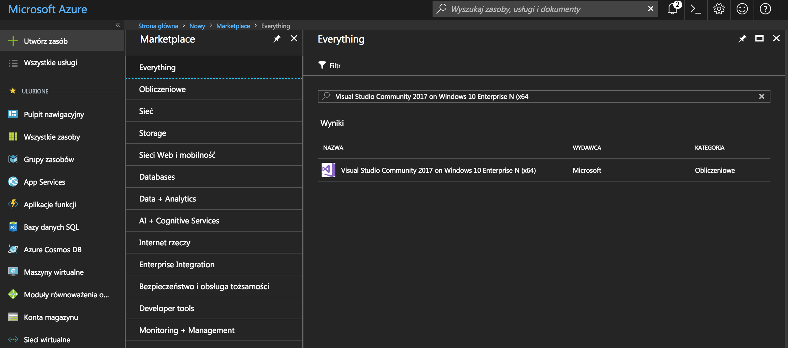
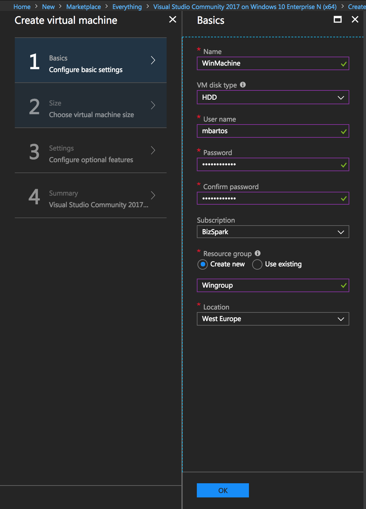
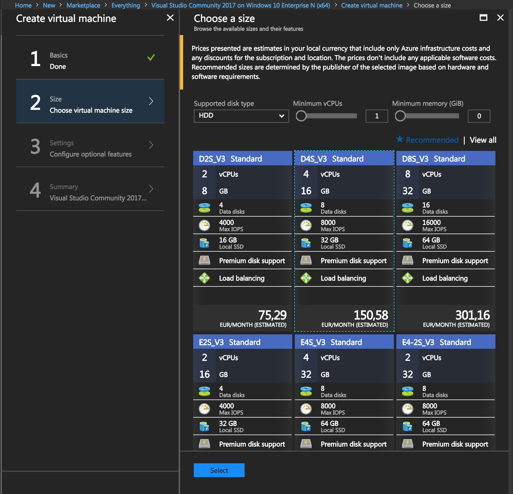
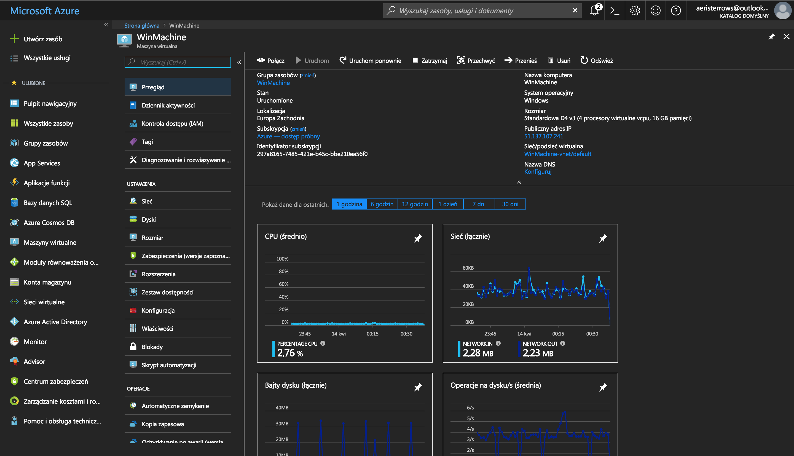
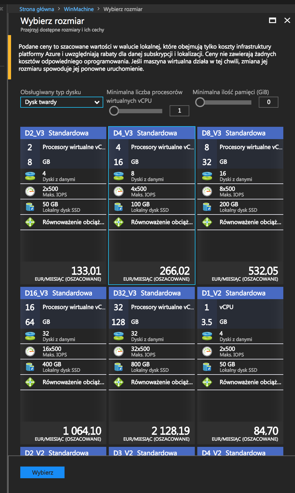
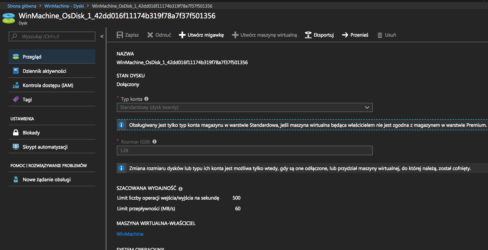

# Virtual machines

## My first resource

Let's begin with creating a remote workspace for yourself, which you can reach from any computer around the world. You don't have to bring your own notebook - all your files and programs will be available on every computer you are using! 

Create a new resource clicking on a "Create resource" in a left top corner.

Now, we will find our resource template on Azure Marketplace:

```text
Visual Studio Community 2017 on Windows Server
```



Click on create and configure all fields:



Next - hardware:



After the configuration you will see a deployment procedure. It should take you no longer than 5 minutes, after which you should see a resource dashboard.




You can connect multiple virtual machines in a subnets!


Let's check available options on a resource sidebar!

## Configuration and connection

Next step is connecting to your VM with a RDP - _Remote Desktop Protocol_.

To establish a connection with your Virtual Machine use a **public IP address** \(visible on resource dashboard\) and application, which supports RDP:

* **Windows**: Remote desktop,
* **OS X**: _Microsoft Remote Desktop_
* **Linux**: _Remmina,_
* **Android**: _Microsoft Remote Desktop_


Linux VM's have SSH enabled and configured by default. 


## Your workspace

On the virtual machine you can find a pre-installed Visual Studio 2017. We will use it for our next step.


Remember that even if you terminate a remote connection with a virtual machine it is still turned on. Keep in mind to shutdown machines to keep your costs as low as possible. You can also configure an **autoshudown** procedure.


Using a virtual machine results in a great CPU, RAM and  disk parameters. With Azure big datacenters your machine have a rapid internet connection and can use local copy of linux repositories.

Please remember about **firewall rules** while changing setting of your VM.

## Scaling

If you need to minify/enlarge computing power of your machine you can instantly change a VM size. Try now to increase your VM class.



## Disk snapshots

You can instantly create disk snapshots, which are being used both for data backup and creating a new VM's from a disk image.

Let's create a new disk snapshot.



