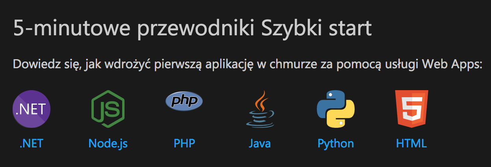

# Web App

Now, let's create your first web app.



Azure can handle many languages, not only .NET!

Choose your favourite one and proceed with a basic web app:



Choose your backend language:

* .NET - [https://docs.microsoft.com/pl-pl/azure/app-service/app-service-web-get-started-dotnet](https://docs.microsoft.com/pl-pl/azure/app-service/app-service-web-get-started-dotnet)
* NodeJS - [https://docs.microsoft.com/pl-pl/azure/app-service/app-service-web-get-started-nodejs](https://docs.microsoft.com/pl-pl/azure/app-service/app-service-web-get-started-nodejs)
* PHP - [https://docs.microsoft.com/pl-pl/azure/app-service/app-service-web-get-started-php](https://docs.microsoft.com/pl-pl/azure/app-service/app-service-web-get-started-php)
* Java - [https://docs.microsoft.com/pl-pl/azure/app-service/app-service-web-get-started-java](https://docs.microsoft.com/pl-pl/azure/app-service/app-service-web-get-started-java)
* Python - [https://docs.microsoft.com/pl-pl/azure/app-service/app-service-web-get-started-python](https://docs.microsoft.com/pl-pl/azure/app-service/app-service-web-get-started-python)
* I don't know, I prefer frontend -  [https://docs.microsoft.com/pl-pl/azure/app-service/app-service-web-get-started-html](https://docs.microsoft.com/pl-pl/azure/app-service/app-service-web-get-started-html)

